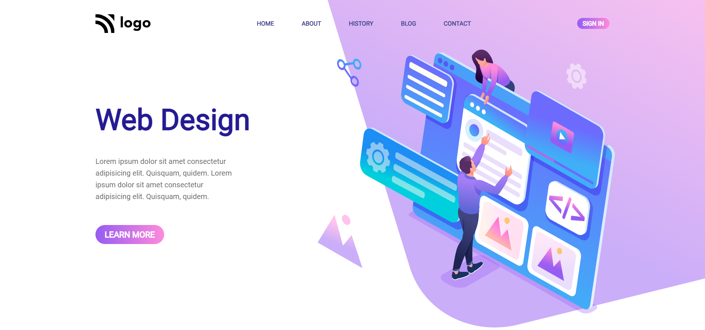

# Full Stack Javascript Bootcamp Assignment 

# Live Project 8 : Web Design Landing Page

## Project 8: (Mobile Responsive)
[Live Link](https://live-project-8-fs-js.netlify.app/)

-   Skills Gained in this project.
    - Learned to use linear gradients on button.
    - Learned how we can center any images as background by using background-position & repeat.
       
---

## Time taken to finish this project(including adding media queries)⏲

- > 7 hours are needed to finish.

#### Screenshot

